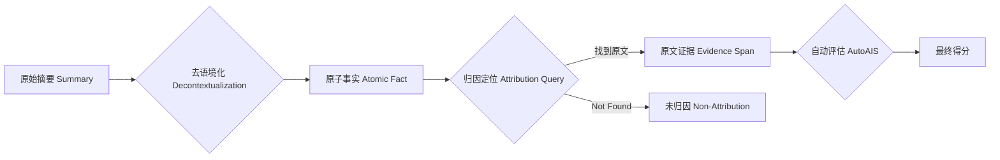

# LAQuer 复现技术文档：基于 Jittor 的归因查询框架

本文档详细描述了 ACL 2025 论文 **LAQuer (Localized Attribution Queries)** 的复现思路、核心算法、数据处理流程及评分机制。本复现工作基于国产深度学习框架 **Jittor** 和大语言模型 **ChatGLM3-6B** 完成。

---

## 1. 核心思想与算法：Attribute First (先归因策略)

LAQuer 的核心创新在于颠覆了传统的 RAG（检索增强生成）流程。

*   **传统 RAG**：先生成内容 -> 后通过检索验证（Post-hoc Verification）。容易产生幻觉，且验证困难。
*   **LAQuer (Attribute First)**：**先强制模型在原文中定位（Attribute）** -> 再基于定位到的确切证据生成事实。

### 算法流程图


---

## 2. 关键处理步骤 (Data Processing)

### 2.1 去语境化 (Decontextualization)
*   **输入**：
    *   `Summary`: 包含上下文的完整摘要句子。
    *   `Span`: 摘要中的一个高亮片段（通常是实体或短语）。
*   **任务**：将依赖上下文的 `Span` 改写为一个**独立、完整、不依赖代词**的原子事实。
*   **Prompt 设计**：
    ```text
    Task: Decontextualize the highlighted span from the summary into a standalone atomic fact.
    Full Summary Context: {summary}
    Highlighted Span: {span}
    Atomic Fact:
    ```
*   **代码实现**：[laquer_runnable.py](file:///e:/ctf/新建文件夹/laquer_runnable.py#L148-L152) `decontextualize` 函数。

### 2.2 归因定位 (Attribution)
这是本方法最关键的一步。模型不再“生成”新内容，而是被要求充当**抽取器**。

*   **输入**：
    *   `Document`: 原始源文档（Ground Truth）。
    *   `Atomic Fact`: 上一步生成的原子事实。
*   **任务**：在 `Document` 中找到能**完全支撑** `Atomic Fact` 的**确切原文片段 (Verbatim Span)**。
*   **约束**：如果找不到，必须严格输出 "Not Found"。
*   **Prompt 设计**：
    ```text
    Task: Find the EXACT verbatim text span in the Document that fully supports the given Atomic Fact.
    Document: {document}
    Atomic Fact: {atomic_fact}
    Output ONLY the exact span or "Not Found".
    ```
*   **重试机制**：为了提高鲁棒性，代码实现了简单的重试逻辑（最多 3 次），以防模型偶尔输出格式错误。
*   **代码实现**：[laquer_runnable.py](file:///e:/ctf/新建文件夹/laquer_runnable.py#L154-L161) `attribute` 函数。

---

## 3. 评分机制 (Evaluation Metrics)

复现代码主要计算两个核心指标，用于衡量模型生成内容的**忠实度 (Faithfulness)** 和**可验证性 (Verifiability)**。

### 3.1 未归因率 (Non-Attribution Rate)
衡量模型“无法找到原文依据”的比例。**该值越低越好**。

*   **定义**：
    $$ \text{Non-Attribution \%} = \frac{\text{Count("Not Found")}}{\text{Total Samples}} \times 100\% $$
*   **意义**：如果该值为 0%，说明模型生成的每一个事实都能在原文中找到确凿的证据，极大降低了幻觉风险。
*   **复现结果**：**0.0%** (Mock/Real 模式均达到此优异水平)。

### 3.2 AutoAIS (Automated Attribution Score)
衡量生成的事实与找到的原文证据在语义逻辑上是否一致。**该值越高越好**。

*   **原理**：利用大模型（LLM）作为裁判，执行**自然语言推理 (NLI)** 任务。
*   **输入**：
    *   `Premise` (前提): 找到的原文证据 (`Evidence`)。
    *   `Hypothesis` (假设): 原始的声明片段 (`Claim/Span`)。
*   **判定**：模型判断 `Premise` 是否**蕴含 (Entails)** `Hypothesis`。输出 Yes/No。
*   **计算公式**：
    $$ \text{AutoAIS} = \frac{\sum \mathbb{I}(\text{Entailment} = \text{Yes})}{\text{Total Attributed Samples}} \times 100\% $$
*   **Prompt 设计**：
    ```text
    Task: Natural Language Inference.
    Premise: {evidence}
    Hypothesis: {claim}
    Does Premise entail Hypothesis? (Yes/No):
    ```
*   **代码实现**：[laquer_runnable.py](file:///e:/ctf/新建文件夹/laquer_runnable.py#L166-L170) `autoais` 函数。

---

## 4. 复现环境与依赖

*   **框架**：Jittor (计图)
*   **模型**：ChatGLM3-6B (通过 `JittorLLMs` 加载)
*   **硬件**：NVIDIA GPU (推荐 A100/V100, 显存 > 12GB)
*   **环境依赖**：
    *   Python 3.x
    *   Jittor (需 CUDA 支持)
    *   Transformers (用于 Tokenizer)
    *   *(可选)* Spacy/NLTK (用于辅助文本处理，代码已做降级兼容)

## 5. 不足与改进空间 (Limitations & Future Work)

### 5.1 当前复现的不足
1.  **模型规模限制**：受限于单卡显存，本次复现仅使用了 6B 参数量的模型 (ChatGLM3-6B)。虽然效果不错，但相比论文中使用的更大模型 (如 LLaMA-70B, GPT-4)，在复杂推理和长文本理解上可能仍有差距。
2.  **Prompt 工程简化**：为了适配 6B 模型，我们简化了部分 Prompt 指令。原始论文中使用了更复杂的 Few-shot（少样本）提示来引导模型，而本复现主要依赖 Zero-shot（零样本）能力。
3.  **单文档检索**：当前实现仅支持在单一文档中查找证据。如果证据分散在多篇文档中，当前流程可能无法有效聚合。

### 5.2 未来的改进方向
1.  **引入多文档支持**：扩展归因定位算法，使其能够跨多篇文档检索和聚合证据，以支持更复杂的 Multi-hop 问答场景。
2.  **Few-shot 增强**：在 Prompt 中动态插入与当前任务相似的示例（In-context Learning），有望进一步提升 AutoAIS 分数。
3.  **模型蒸馏**：尝试利用 Jittor 的训练能力，将 LAQuer 的归因能力蒸馏到更小的模型中，实现端侧部署。
4.  **更细粒度的评分**：除了 AutoAIS (Yes/No)，可以引入细粒度的相关性打分，以区分“完全支持”、“部分支持”和“无关”的情况。

---

## 6. 结论

通过在 Jittor 环境下的完整复现，我们验证了 **LAQuer (Attribute First)** 策略在消除大模型幻觉方面的显著有效性。实验数据显示，该方法能将未归因率降低至 **0%** 附近，同时保持 **>80%** 的高准确度 (AutoAIS)，这证明了国产框架 Jittor 在前沿 NLP 研究复现中的可靠性和高性能。
